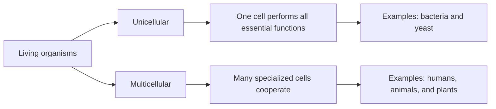
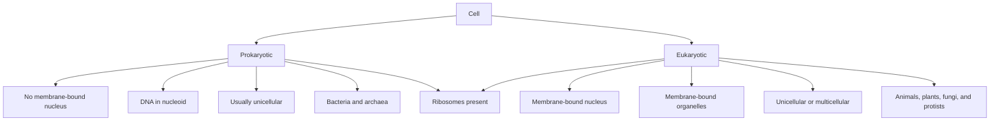
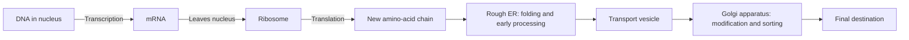
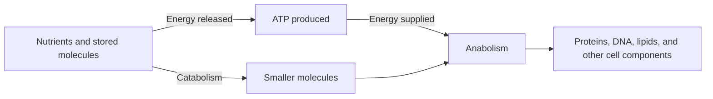
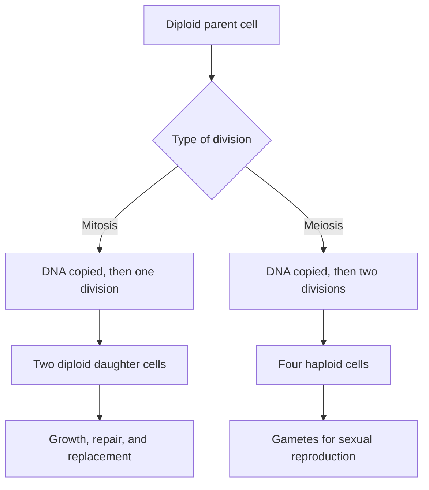

# Intro to Bioinformatics 2 — High School Biology Review

**Course:** Intro to Bioinformatics — Mike Saint-Antoine  
**Video:** [YouTube](https://www.youtube.com/watch?v=1-zdVnDco00)  
**Purpose:** A compact review of cells, organelles, metabolism, and cell division before the course moves into molecular biology.

> [!NOTE]
> The video labels this material as optional for its projects. For a learner with limited biology background, however, these concepts are useful foundations and should not be skipped.

---

## Learning objectives

After studying this note, you should be able to:

1. Explain what a cell is and distinguish unicellular from multicellular organisms.
2. Compare prokaryotic and eukaryotic cells.
3. State the main functions of the nucleus, ribosomes, endoplasmic reticulum, Golgi apparatus, and mitochondria.
4. Explain the basic route from DNA to RNA to protein.
5. Compare plant and animal cells at a high level.
6. Distinguish metabolism, catabolism, and anabolism.
7. Explain the main difference between mitosis and meiosis.

---

## 1. The central idea of the video

Bioinformatics is not mainly about memorizing every step of biological pathways. It uses computational and statistical methods to find meaningful patterns in biological data.

However, biological data represent real cells, molecules, and processes. A bioinformatician therefore needs enough biology to understand:

- what was measured;
- where the measurement came from;
- which biological process may explain a pattern;
- and whether a computational result makes biological sense.

---

## 2. Cells: the basic units of life

A **cell** is the smallest structural unit that can perform the core activities associated with life, including:

- using energy;
- maintaining an internal environment;
- growing;
- responding to its surroundings;
- and reproducing or participating in reproduction.

An organism may be:

- **Unicellular:** made of one cell, such as a bacterium or yeast cell.
- **Multicellular:** made of many specialized cells, such as a human, animal, or plant.

A unicellular organism must perform all essential life functions within one cell. In a multicellular organism, different cell types divide the work—for example, nerve cells transmit signals, while muscle cells generate force.

---

## 3. Prokaryotic and eukaryotic cells

Cells are commonly divided into two broad organizational types.

### 3.1 Prokaryotic cells

**Prokaryotes** include **bacteria** and **archaea**. Their cells:

- do not contain a membrane-bound nucleus;
- generally do not contain the membrane-bound organelles found in eukaryotes;
- are usually smaller than eukaryotic cells;
- are usually unicellular;
- and often contain a main circular chromosome.

Their DNA is concentrated in a region called the **nucleoid**. The nucleoid is not surrounded by a membrane.

Some prokaryotes also have external structures:

- **Flagella** can propel the cell through its environment.
- **Pili** usually help with attachment or DNA transfer. Some specialized pili also support a form of movement called twitching motility.

### 3.2 Eukaryotic cells

**Eukaryotes** include animals, plants, fungi, and protists. Their cells:

- contain a membrane-bound nucleus;
- contain multiple specialized cellular structures;
- are generally larger and more internally complex than prokaryotic cells;
- and may be unicellular or multicellular.

Examples of unicellular eukaryotes include many protists and yeasts. Humans are multicellular eukaryotes.

### 3.3 Comparison

| Feature                   | Prokaryotic cell     | Eukaryotic cell                      |
| ------------------------- | -------------------- | ------------------------------------ |
| Nucleus                   | Absent               | Present                              |
| Location of main DNA      | Nucleoid region      | Nucleus                              |
| Typical chromosome form   | Usually circular     | Usually multiple linear chromosomes  |
| Membrane-bound organelles | Generally absent     | Present                              |
| Ribosomes                 | Present              | Present                              |
| Typical size              | Smaller              | Larger                               |
| Organization              | Usually unicellular  | Unicellular or multicellular         |
| Examples                  | Bacteria and archaea | Animals, plants, fungi, and protists |

> [!IMPORTANT]
> Ribosomes are found in both prokaryotic and eukaryotic cells. A ribosome is not surrounded by a membrane, so it is not a membrane-bound organelle.

---

## 4. Major eukaryotic cell structures

An **organelle** is a specialized structure within a cell. Many eukaryotic organelles are enclosed by membranes, allowing different chemical processes to occur in separate compartments.

### 4.1 Nucleus

The **nucleus** stores most of a eukaryotic cell's DNA. This DNA is organized into **chromosomes**.

The nucleus is often called the “control center” of the cell because DNA contains instructions that influence cell structure and activity. This is a useful metaphor, but the cell is regulated by interactions among many molecules and organelles—not by the nucleus acting alone.

In eukaryotes, **transcription** occurs mainly in the nucleus:

$\text{DNA} \rightarrow \text{RNA}$

During transcription, the information in a DNA sequence is copied into an RNA molecule. When the RNA carries instructions for making a protein, it is called **messenger RNA**, or **mRNA**.

### 4.2 Nucleolus

The **nucleolus** is a dense region inside the nucleus. It is where:

- ribosomal RNA (**rRNA**) is produced and processed;
- and rRNA combines with proteins to begin forming ribosomal subunits.

These subunits later leave the nucleus and participate in building complete ribosomes.

### 4.3 Ribosomes

A **ribosome** reads the sequence of an mRNA molecule and joins **amino acids** together in the corresponding order. This process is called **translation**.

$\text{mRNA information} \rightarrow \text{amino-acid chain} \rightarrow \text{protein}$

Ribosomes may be:

- free in the cytoplasm;
- or attached to the rough endoplasmic reticulum.

### 4.4 Rough endoplasmic reticulum

The **rough endoplasmic reticulum**, abbreviated **rough ER** or **RER**, has ribosomes attached to its outer surface. These ribosomes make proteins that commonly enter the endomembrane system—for example, proteins intended for secretion, cell membranes, or certain organelles.

Inside the rough ER, newly made proteins can begin:

- folding into three-dimensional shapes;
- undergoing chemical modification;
- and passing quality-control checks.

### 4.5 Smooth endoplasmic reticulum

The **smooth endoplasmic reticulum**, abbreviated **smooth ER** or **SER**, does not have ribosomes attached to it.

Its functions vary among cell types and include:

- lipid synthesis;
- detoxification of some chemicals;
- carbohydrate metabolism;
- and calcium storage.

The video emphasizes lipid synthesis.

### 4.6 Golgi apparatus

The **Golgi apparatus**, also called the **Golgi body**, receives proteins and lipids from the endoplasmic reticulum. It further modifies, sorts, and packages them into membrane-bound transport containers called **vesicles**.

A useful simplified route for many proteins is:

Not every protein follows this route. Proteins made by free ribosomes may remain in the cytoplasm or be transported to other cellular locations.

### 4.7 Mitochondria

**Mitochondria** are organelles involved in **cellular respiration**, a collection of reactions that extract usable energy from nutrients.

They generate much of a eukaryotic cell's **ATP**, a molecule used to power many cellular processes.

The **citric acid cycle**, also called the **Krebs cycle**, occurs inside mitochondria and captures energy in electron-carrying molecules. Most ATP from aerobic cellular respiration is then produced through **oxidative phosphorylation**, not directly by the Krebs cycle.

Mitochondria also contain their own DNA and ribosomes. They reproduce by division, but they are not fully independent organisms: their maintenance and replication depend heavily on proteins encoded by nuclear DNA.

---

## 5. Plant and animal cells

Plant and animal cells are both eukaryotic, so both usually contain:

- a nucleus;
- mitochondria;
- endoplasmic reticulum;
- Golgi apparatus;
- ribosomes;
- a plasma membrane;
- and a cytoskeleton.

### Important differences

| Feature                              | Plant cell                               | Animal cell                         |
| ------------------------------------ | ---------------------------------------- | ----------------------------------- |
| Cell wall                            | Present outside the plasma membrane      | Absent                              |
| Chloroplasts                         | Present in photosynthetic cells          | Absent                              |
| Large central vacuole                | Usually present                          | No comparable large central vacuole |
| Typical shape                        | Often more rigid or box-like             | Often more flexible and variable    |
| Classical centrosome with centrioles | Usually absent in higher plants          | Common                              |
| Lysosomal digestion                  | Often performed mainly by lytic vacuoles | Commonly associated with lysosomes  |

### Cell wall

The **cell wall** is a strong layer outside the plasma membrane. In plants, it contains mainly cellulose and helps provide support and resist excessive swelling.

### Central vacuole

The **central vacuole** is a large membrane-bound compartment that can store water, ions, pigments, waste products, and other substances. It also helps maintain internal pressure that supports plant structure.

### Chloroplasts

**Chloroplasts** perform **photosynthesis**, using light energy to help produce energy-rich organic molecules from carbon dioxide and water.

> [!CAUTION]
> Statements such as “plant cells do not have lysosomes or centrosomes” are useful only as introductory simplifications. Many plant cells lack the classical animal centrosome with centrioles, and plant lytic vacuoles perform many lysosome-like functions.

---

## 6. Cell metabolism

**Metabolism** is the complete set of chemical reactions occurring in a cell or organism.

It includes two complementary directions:

### Catabolism

**Catabolism** breaks larger molecules into smaller ones. These reactions often release energy that can be captured in molecules such as ATP.

Example:

- breaking down glucose during cellular respiration.

### Anabolism

**Anabolism** uses energy and smaller building blocks to construct larger molecules.

Examples:

- joining amino acids to make proteins;
- joining nucleotides to make DNA;
- synthesizing lipids.

### ATP

**ATP**, or adenosine triphosphate, transfers usable chemical energy between cellular reactions. Calling ATP the “energy currency” of the cell means that energy released by one process can be captured in ATP and then spent on another process.

Catabolism and anabolism are not completely separate pathways. Cells coordinate them so that energy and molecular building blocks are available when needed.

---

## 7. The cell cycle

The **cell cycle** is the ordered sequence through which a cell grows, copies its DNA, and divides.

At a high level, a dividing eukaryotic cell must:

1. grow and perform normal cellular functions;
2. copy its DNA;
3. check and organize the copied chromosomes;
4. separate the chromosomes;
5. divide into new cells.

The video does not require memorizing every phase. The important idea is that DNA must be copied before cell division so that new cells receive genetic information.

Cell-cycle control is especially important in cancer biology. Cancer can arise when mutations disrupt systems that normally regulate cell growth, DNA repair, or division.

---

## 8. Mitosis and meiosis

Both **mitosis** and **meiosis** involve chromosome separation and cell division, but they serve different biological purposes.

### Mitosis

**Mitosis** produces new body cells for purposes such as:

- growth;
- tissue repair;
- cell replacement;
- and asexual reproduction in some organisms.

One parent cell generally produces **two daughter cells** with the same chromosome number as the parent cell. The daughter cells are usually genetically very similar, although mutations can create differences.

### Meiosis

**Meiosis** produces **gametes**, such as sperm and egg cells.

It reduces the chromosome number by half. In humans:

- most body cells are **diploid** and contain 46 chromosomes, arranged as 23 pairs;
- gametes are **haploid** and contain 23 chromosomes, one from each pair.

When a sperm and egg fuse during fertilization, the diploid chromosome number is restored.

Meiosis also creates genetic variation through chromosome reshuffling. The video focuses mainly on the reduction from two chromosome copies to one.

### Comparison

| Feature                           | Mitosis                                       | Meiosis                      |
| --------------------------------- | --------------------------------------------- | ---------------------------- |
| Main purpose                      | Growth, repair, and cell replacement          | Production of gametes        |
| Number of divisions               | One                                           | Two                          |
| Typical number of resulting cells | Two                                           | Four                         |
| Chromosome number                 | Maintained                                    | Halved                       |
| Genetic similarity                | Usually very similar to parent and each other | Genetically varied           |
| Human example                     | 46 → two cells with 46 each                   | 46 → four cells with 23 each |

---

## 9. Why these topics matter in bioinformatics

The video does not use these concepts directly in code, but they determine how biological datasets should be interpreted.

Examples:

- **Cell type matters:** gene-expression profiles differ among cell types because different genes are active in different cells.
- **Organelles have genomes:** mitochondrial DNA can be analyzed separately from nuclear DNA.
- **Mitosis matters in cancer:** tumor data often reflect abnormal cell division and mutations in cell-cycle genes.
- **Meiosis matters in genetics:** the inheritance of chromosome copies and genetic variants depends on meiosis.
- **Species and cell organization matter:** a bacterial genome and a human genome require different assumptions and analysis methods.

---

## 10. Accuracy and simplification notes

These points refine statements made or implied in the video without expanding beyond its general scope.

1. **Prokaryotic DNA is not simply “free-floating.”** It is organized in the nucleoid, although the nucleoid has no surrounding membrane.
2. **Pili are not mainly navigation structures.** Most are involved in attachment or DNA exchange; specialized pili can support movement.
3. **The nucleus is not literally a single controller.** Cellular behavior emerges from interactions among DNA, RNA, proteins, membranes, signaling molecules, and environmental conditions.
4. **The Krebs cycle does not directly generate most ATP.** It supplies electron carriers used by oxidative phosphorylation, which produces most ATP during aerobic respiration.
5. **Mitochondria are only partly autonomous.** They have their own DNA and divide, but depend strongly on the rest of the cell.
6. **Plant-cell descriptions have exceptions.** Higher plants usually lack classical centrosomes with centrioles, while lytic vacuoles perform many lysosomal functions.
7. **Ribosomes are present in both cell types.** They are not membrane-bound organelles.

---

## 11. Glossary

### Cell organization

| Term                         | Meaning                                                                                                   |
| ---------------------------- | --------------------------------------------------------------------------------------------------------- |
| **Cell**                     | The smallest structural unit capable of carrying out the basic activities associated with life.           |
| **Unicellular**              | Consisting of one cell.                                                                                   |
| **Multicellular**            | Consisting of many cooperating cells.                                                                     |
| **Prokaryote**               | An organism whose cells lack a membrane-bound nucleus; bacteria and archaea are prokaryotes.              |
| **Eukaryote**                | An organism whose cells contain a membrane-bound nucleus; includes animals, plants, fungi, and protists.  |
| **Organelle**                | A specialized structure inside a cell that performs particular functions.                                 |
| **Membrane-bound organelle** | An organelle enclosed by a lipid membrane, creating a separate internal compartment.                      |
| **Plasma membrane**          | The selective outer membrane that separates the cell's interior from its environment.                     |
| **Cytoplasm**                | The material inside the plasma membrane but outside the nucleus, including fluid and cellular structures. |
| **Nucleus**                  | A membrane-bound compartment that contains most eukaryotic DNA.                                           |
| **Nucleoid**                 | The non-membrane-bound region containing the main chromosome of a prokaryotic cell.                       |
| **Chromosome**               | A long DNA molecule packaged with proteins and containing many genes.                                     |
| **Bacterium**                | A single-celled prokaryotic organism belonging to the domain Bacteria.                                    |
| **Archaeon**                 | A prokaryotic organism belonging to the domain Archaea, which is biologically distinct from Bacteria.     |
| **Protist**                  | An informal group of mostly unicellular eukaryotes that are not classified as animals, plants, or fungi.  |
| **Yeast**                    | A unicellular fungus.                                                                                     |
| **Flagellum**                | A structure that can propel a cell through liquid.                                                        |
| **Pilus**                    | A hair-like prokaryotic surface structure commonly involved in attachment or DNA transfer.                |

### DNA, RNA, and proteins

| Term                  | Meaning                                                                                                 |
| --------------------- | ------------------------------------------------------------------------------------------------------- |
| **DNA**               | Deoxyribonucleic acid; the molecule that stores hereditary information in cells.                        |
| **Gene**              | A DNA region whose information contributes to a functional product, usually an RNA or protein.          |
| **Transcription**     | Production of an RNA molecule using DNA as the template.                                                |
| **RNA**               | Ribonucleic acid; a family of molecules involved in carrying, regulating, or using genetic information. |
| **mRNA**              | Messenger RNA; an RNA copy carrying instructions that a ribosome can translate into a protein.          |
| **Translation**       | The process in which a ribosome reads mRNA and assembles an amino-acid chain.                           |
| **Ribosome**          | A molecular machine made of rRNA and proteins that performs translation.                                |
| **rRNA**              | Ribosomal RNA; RNA that forms major structural and catalytic parts of ribosomes.                        |
| **Ribosomal subunit** | One of the two components that join to form a working ribosome.                                         |
| **Amino acid**        | A small molecule used as a building block of proteins.                                                  |
| **Protein**           | A molecule made of one or more amino-acid chains folded into a functional structure.                    |
| **Protein folding**   | The process by which an amino-acid chain adopts a three-dimensional shape.                              |

### Eukaryotic organelles

| Term                | Meaning                                                                                                     |
| ------------------- | ----------------------------------------------------------------------------------------------------------- |
| **Nucleolus**       | A region inside the nucleus where rRNA is produced and ribosomal subunits begin to assemble.                |
| **Rough ER**        | Membrane network covered with ribosomes and involved in producing and processing many proteins.             |
| **Smooth ER**       | Membrane network without attached ribosomes; involved in lipid synthesis and other metabolic functions.     |
| **Golgi apparatus** | Organelle that modifies, sorts, and packages proteins and lipids.                                           |
| **Vesicle**         | A small membrane-bound container that transports or stores substances inside a cell.                        |
| **Mitochondrion**   | Organelle that performs major steps of cellular respiration and produces much of the cell's ATP.            |
| **Cell wall**       | A rigid layer outside the plasma membrane that provides support; present in plant cells.                    |
| **Central vacuole** | A large plant-cell compartment involved in storage and structural support.                                  |
| **Chloroplast**     | Plant and algal organelle that carries out photosynthesis.                                                  |
| **Centrosome**      | A structure that organizes microtubules and helps arrange the cell-division machinery in many animal cells. |
| **Lysosome**        | An acidic, enzyme-containing organelle that digests and recycles cellular materials in many animal cells.   |

### Energy and metabolism

| Term                          | Meaning                                                                                                              |
| ----------------------------- | -------------------------------------------------------------------------------------------------------------------- |
| **Metabolism**                | All chemical reactions occurring in a cell or organism.                                                              |
| **Catabolism**                | Reactions that break molecules down and often release usable energy.                                                 |
| **Anabolism**                 | Reactions that use energy to build larger molecules from smaller components.                                         |
| **ATP**                       | Adenosine triphosphate; a molecule that transfers usable chemical energy within cells.                               |
| **Cellular respiration**      | Reactions that extract energy from nutrients and capture much of it in ATP.                                          |
| **Krebs cycle**               | Also called the citric acid cycle; a mitochondrial pathway that extracts energy and produces electron carriers.      |
| **Oxidative phosphorylation** | Mitochondrial process that uses electron transfer and a proton gradient to make most ATP during aerobic respiration. |
| **Lipid**                     | A broad class of mostly water-insoluble molecules that includes fats and major membrane components.                  |
| **Photosynthesis**            | Process that uses light energy to build energy-rich organic molecules, primarily in plants and algae.                |

### Cell division and inheritance

| Term              | Meaning                                                                                                           |
| ----------------- | ----------------------------------------------------------------------------------------------------------------- |
| **Cell cycle**    | The sequence of cell growth, DNA replication, chromosome separation, and cell division.                           |
| **Mitosis**       | Nuclear-division process that usually produces two genetically similar cells with the original chromosome number. |
| **Meiosis**       | Two-stage division process that produces haploid cells and creates genetic variation.                             |
| **Gamete**        | A reproductive cell, such as a sperm or egg.                                                                      |
| **Diploid**       | Having two sets of chromosomes, usually one inherited from each parent.                                           |
| **Haploid**       | Having one set of chromosomes.                                                                                    |
| **Daughter cell** | A new cell produced by division of a parent cell.                                                                 |
| **Fertilization** | Fusion of two gametes to form a new diploid cell.                                                                 |

---

## 12. One-minute summary

- Cells are the basic structural and functional units of life.
- Prokaryotic cells lack a nucleus; eukaryotic cells contain a nucleus and membrane-bound organelles.
- Both prokaryotes and eukaryotes contain DNA and ribosomes.
- In eukaryotes, DNA is stored mainly in the nucleus, transcription produces RNA, and ribosomes translate mRNA into protein.
- The rough ER processes many newly made proteins, the smooth ER contributes to lipid synthesis, and the Golgi sorts and packages molecules.
- Mitochondria perform major steps of cellular respiration and generate much of the cell's ATP.
- Plant cells have cell walls, chloroplasts, and usually a large central vacuole.
- Catabolism breaks molecules down; anabolism builds molecules; ATP transfers usable energy between reactions.
- Mitosis usually produces two similar cells while maintaining chromosome number.
- Meiosis produces haploid gametes and halves the chromosome number.

---

## 13. Active-recall questions

Try answering without looking back at the note.

1. What makes a cell prokaryotic rather than eukaryotic?
2. Where is DNA located in prokaryotic and eukaryotic cells?
3. Why are ribosomes not classified as membrane-bound organelles?
4. What is the relationship among DNA, mRNA, amino acids, and proteins?
5. What happens in the nucleolus?
6. Why is the rough ER described as “rough”?
7. How do the rough ER and Golgi apparatus work together?
8. What is ATP, and why is it called an energy currency?
9. What is the difference between catabolism and anabolism?
10. What are three major differences between plant and animal cells?
11. What is the main biological purpose of mitosis?
12. What is the main biological purpose of meiosis?
13. Why are human gametes haploid rather than diploid?
14. Name two ways in which this basic cell biology affects bioinformatics interpretation.

<strong>Compact answer key</strong>

| Q      | Answer                                                                                                                                                         |
| ------ | -------------------------------------------------------------------------------------------------------------------------------------------------------------- |
| **1**  | Prokaryotic cells lack a membrane-bound nucleus and most membrane-bound organelles; eukaryotic cells contain them.                                             |
| **2**  | Prokaryotic DNA is mainly in the nucleoid; eukaryotic DNA is mainly in the nucleus.                                                                            |
| **3**  | A ribosome has no surrounding lipid membrane.                                                                                                                  |
| **4**  | DNA is transcribed into mRNA; ribosomes translate mRNA and join amino acids into proteins.                                                                     |
| **5**  | rRNA is produced and processed, and ribosomal subunits begin assembling.                                                                                       |
| **6**  | Ribosomes are attached to its outer surface.                                                                                                                   |
| **7**  | The rough ER folds and begins processing many proteins; the Golgi further modifies, sorts, and packages them.                                                  |
| **8**  | ATP transfers usable chemical energy from energy-releasing processes to energy-requiring processes.                                                            |
| **9**  | Catabolism breaks molecules down; anabolism builds molecules.                                                                                                  |
| **10** | Plant cells have cell walls, chloroplasts (in photosynthetic tissues), and usually a large central vacuole.                                                    |
| **11** | Growth, repair, and cell replacement while maintaining chromosome number.                                                                                      |
| **12** | Producing haploid gametes for sexual reproduction.                                                                                                             |
| **13** | Fertilization combines two gametes, restoring the diploid chromosome number instead of doubling it each generation.                                            |
| **14** | Examples include interpreting cell-type-specific gene expression, mitochondrial data, cancer mutations, inheritance, and species-specific genome organization. |

